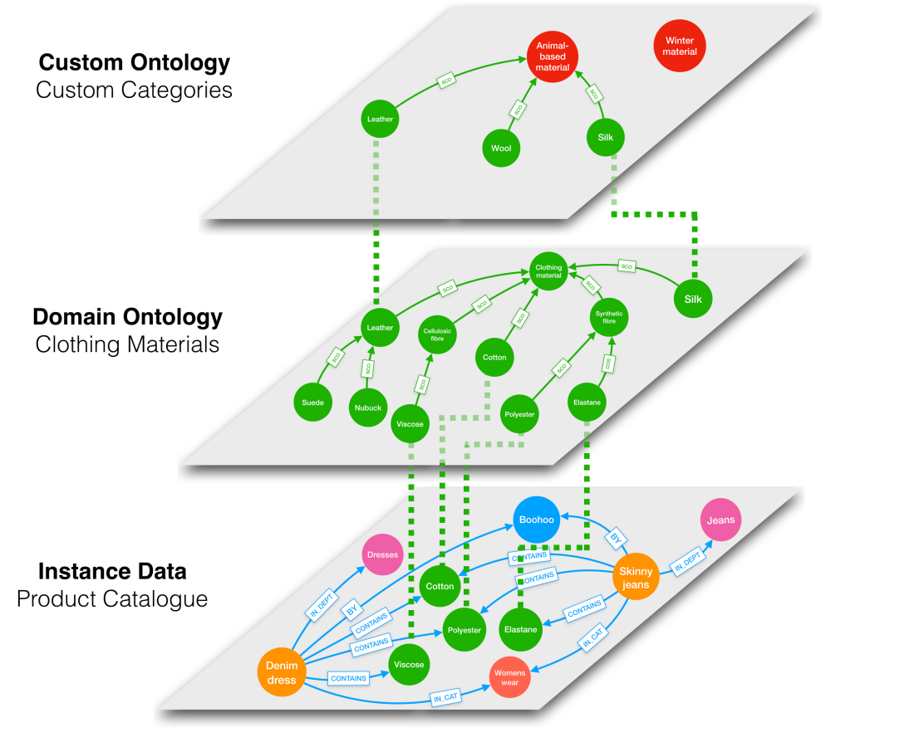

# neosemantics-python-examples
Some examples of use of the [neosemantics plugin](https://github.com/neo4j-labs/neosemantics) for [Neo4j](https://neo4j.com/).

CONTENTS:
* Importing JSON-LD from a zipped file in jsonline format ([link to source](https://github.com/jbarrasa/neosemantics-python-examples/blob/master/jsonlines/loadRDFFromJsonLines.py)).
* Loading into [RDFLib](https://rdflib.readthedocs.io/en/stable/) the result of a cypher query on your Neo4j graph ([link to source](https://github.com/jbarrasa/neosemantics-python-examples/blob/master/rdflib/loadRDFFromCypher.py)).
* Ontology import + inferencing. Source for the experiment described in [this blogpost](https://jbarrasa.com/2019/11/25/quickgraph9-the-fashion-knowledge-graph-inferencing-with-ontologies-in-neo4j/) are available in [this folder](https://github.com/jbarrasa/neosemantics-python-examples/tree/master/inferencing). 
* Querying [Wikidata](https://query.wikidata.org/) with SPARQL and importing the resulting RDF into Neo4j (link to [source](https://github.com/jbarrasa/neosemantics-python-examples/tree/master/wikidata) and to [blog post](https://jbarrasa.com/2019/12/05/quickgraph10-enrich-your-neo4j-knowledge-graph-by-querying-wikidata/) with explanation).
* Building a knowledge graph by importing an RSS feed + RDFa of individual articles (serialised as JSON-LD). Link to [source](https://github.com/jbarrasa/neosemantics-python-examples/blob/master/rss_rdfa/html_metadata.py)   

## Example

[QuickGraph#9 The fashion Knowledge Graph. Inferencing with Ontologies in Neo4j](https://jbarrasa.com/2019/11/25/quickgraph9-the-fashion-knowledge-graph-inferencing-with-ontologies-in-neo4j/)

